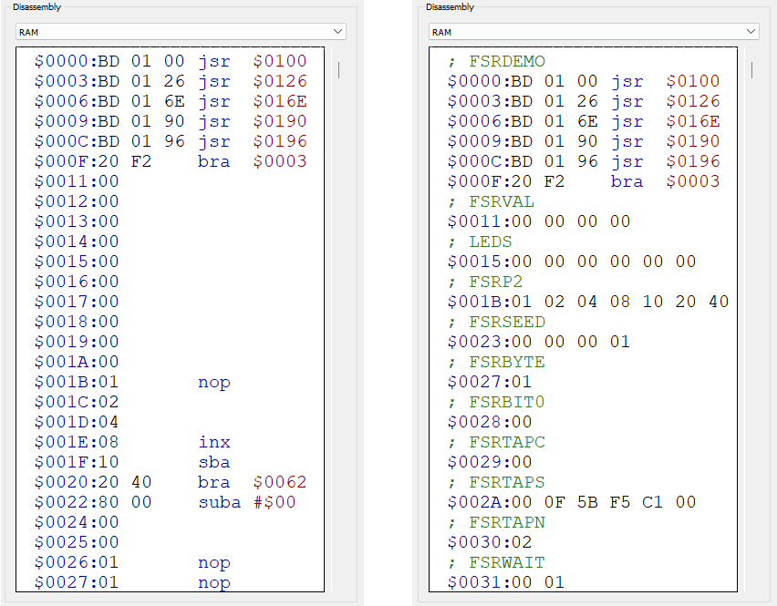

# ET-3400 Emulator

This is an emulator for the [Heathkit ET-3400 Trainer](http://www.oldcomputermuseum.com/heathkit_et3400.html) built in C++.

This is a port of my emulator built in C# (https://github.com/RupertAvery/et3400-emu) with the goal of better performance and speed accuracy, as well as portability, with Windows and Linux targets.

The Heathkit ET-3400 Trainer is a device intended to teach microprocessor basics and assembly programming. The trainer was sold in kit form, requiring the user to build the device from parts.

## What's emulated

* Motorola 8-bit 6800 CPU running at 471kHz 
* 6 7-segment LED displays
* the hex keypad

A built-in ROM is provided. The ROM contains the Monitor program for the Heathkit ET-3400 Trainer, which interacts with the keypad and display to run programs and view CPU registers.


# Features

* [Loading files into RAM](#loading-files-into-ram)
* [Saving Program RAM](#saving-program-ram)
* [Loading alternate ROM files](#loading-alternate-rom-files)
* [Debugger](#debugger)
* [Breakpoints](#breakpoints)
* [Labels](#labels)

## Loading programs into RAM

You can load programs compiled from another device into emulator RAM. 

Click `File` > `Load RAM` and select your file to load it into memory. 

The emulator supports the following formats:

Format | Extensions
-------|-----------
[Motorola S-record](https://en.wikipedia.org/wiki/Motorola_S-record) | `.S19` `.OBJ` 
[Intel HEX](https://en.wikipedia.org/wiki/Intel_HEX) | `.HEX` 


## Saving Program RAM

You can save a range of RAM to a file so you can continue working on it at a later time.

Click `File` > `Save RAM` and select the file to save RAM to. 

You will be prompted to set the range of RAM that will be written to the file. The default range is `$0000` - `$01FF`

The same formats for loading RAM are supported.

## Loading alternate ROM files

You can load alternative / modded ROM files. The ROM should be exactly 1024 bytes.  Click `File` > `Load ROM` and select your file to load it into the ROM at `$FC00`. 

The following formats are supported:

Format | Extensions
-------|-----------
[Motorola S-record](https://en.wikipedia.org/wiki/Motorola_S-record) <sup>1</sup> | `.S19` `.OBJ` 
[Intel HEX](https://en.wikipedia.org/wiki/Intel_HEX) <sup>1</sup> | `.HEX` 
Raw Binary <sup>2</sup> | `.BIN` 

<sup>1</sup> For the S-Record and HEX format, you must ensure that the start address is at `$FC00` and the reset vector is set accordingly. 

<sup>2</sup> The BIN format is raw bytes in binary format with no headers. The file should be exactly 1024 bytes to fit in the ROM address space.


## Labels

Labels allow you to label and categorize areas of memory and affect the way the memory is disassembled. The main purpose of this is to set a range of memory memory as a "data" block, forcing the disassembler to skip over the range and prevent it from being disassembled as instructions.

This is important when you have a section of memory that does not contain code and should not be disassembled as instructions.

This allows any code following the data to be disassembled correctly.

Below is a view of a section of RAM before and after adding labels.



### Adding Labels

Labels can be added from the toolbar menu (Labels > Add Label) or by right-clicking on an unlabeled line in the disassembly view. 


You will be prompted to select a type of label, Comment or Data. 

**Comment** will treat memory at the start address as an instruction, not affecting disassembly.

**Data** requires a start address and end address, will treat memory between the the start and end address as data, skipping disassembly over the range and displaying the memory as raw data.


### Editing and Removing Labels

You can edit or remove a label by right-clicking on a labeled range in the disassembly view.


### Loading and Saving Labels

Labels can be loaded and saved from the toolbar menu (File > Load Labels (RAM) and File > Save Labels (RAM))

## Debugger

The emulator features a debugger which allows you to stop emulation and step into each instruction and see memory and registers update in real time.

### Controls

Aside from the controls in the toolbar, emulation can be controlled with the following keys

* F5 - Start emulation
* F4 - Stop emulation
* F9 - Toggle Breakpoint on the currently highlighted line
* 10 - Step into next instruction
* ESC - Reset emulator


## Breakpoints

### Setting a breakpoint

You can toggle a breakpoint at the currently selected line in the disassembly view by pressing F9.

You can also toggle a breakpoint at any line by hovering over the leftmost side of the disassembly view. An empty red circle will appear indicating a breakpoint can be set.


Setting a breakpoint will add a filled red circle to the left of the instructions, indicating that a breakpoint has been set.


### Hitting a breakpoint

When execution reaches the instruction where the breakpoint is set, the emulator will stop and the background color of the line will change to yellow, indicating that the instruction will be executed next when the emulator advances.


### Loading and Saving Breakpoints

Breakpoints can be loaded and saved from the toolbar menu (File > Load Breakpoints and File > Save Breakpoints)


# Manual

The original manual for this trainer is available in pdf format here: https://archive.org/details/HeathkitManualForTheEt-3400MicroprocessorTrainer

The manual describes assembling the kit, discusses basic operation and troubleshooting and includes sample program listings as well as an listing of the monitor ROM program.

It is a wealth of information and it is recommended that you take a look at it to understand how the device works. Listed below are sections that should be of particular interest.

| PDF Page | Manual Page | Section              | 
|:--------:|:-----------:|----------------------|
| 47-56    |  45-54      | Operation            |
| 57-66    |  55-64      | Sample Programs      |
| 67-74    |  65-72      | Sample Programs      |
| 75-87    |  73-85      | Monitor ROM Listing  |
| 89       |  87         | Memory Map           |
| 90       |  88         | Keyboard and Display Functioning Addresses |
| 91-92    |  89-90      | Instruction Set      |
| 110-111  |  108-109    | Theory of Operation  |
| 113      |   111       | Integrated Circuits  |
| 148-149  |             | Block Diagram        |
| 151-159  |             | Schematic Diagram    |


**NOTE:** The Monitor ROM listing is incomplete as it omits several sections either for brevity or it seems by accident.

```
FC09-FC0B - data
FC46-FC7D - BKSET and DOPMT routines
FD5A - data
FD62 - data
FF2A-FF2F - Start of SPECIAL HANDLERS
FF76 - FFF8 - data
```

and maybe a pointer to the ET-3400 groups.io
home page and "... complete source code available in the Files section
of this group".  Or perhaps an even more global statement pointing to
that home page, regarding the extensive collection of related
documentation there.


## Basic Usage

On startup, the display will read `CPU UP`.

Pressing one of the buttons will execute one of the built-in commands in the ROM. You can press the button by clicking with a mouse pointer, or pressing the corresponding key on the keybaord.

| Keypress |    Button     | Action                                            | 
|:--------:|:-------------:|---------------------------------------------------|
|    1     |  **ACCA**     | View contents of Accumulator A Register           |
|    2     |  **ACCB**     | View contents of Accumulator B Register		   |
|    3     |  **PC**       | View contents of Program Counter Register		   |
|    4     |  **INDEX**    | View contents of Index Pointer Register		   |
|    5     |  **CC**       | View contents of Condition Codes Register		   |
|    6     |  **SP**       | View contents of Stack Pointer Register		   |
|    7     |  **RTI**      | Execute Return from Interrupt							   |
|    8     |  **SS**       | Single Step									   |
|    9     |  **BR**       | Break											   |
|    A     |  **AUTO**     | Start entering hex at specified address		   |
|    B     |  **BACK**     | During Examine mode, move address back		       |
|    C     |  **CHAN**     | During Examine mode, edit hex at specified address. During ACCA/ACCB/PC mode, edit hex in selected register |
|    D     |  **DO**       | Execute RAM at given address                      |
|    E     |  **EXAM**     | Start viewing hex at specified address            |
|    F     |  **FWD**      | During Examine mode, move address forward         |
|   ESC    |  **RESET**    | Reset the CPU <sup>1</sup>        |

**Notes**

<sup>1</sup> Resetting only takes effect while the CPU is being clocked. Pressing RESET or ESC while the CPU is paused will have no effect. Pressing  it and then single stepping will also have no effect as the RESET line will have been released when you release the button. 


## Sample Program

This sample program will light up each segment on each display and repeat.

To enter the program, press `A` then enter `0000` to start entering hex data.

Enter the instructions in the Instr column below, ensuring that each instruction starts at the correct address. If you make a mistake, you can press ESC to reset then press `A` and enter the address to resume entering instructions.

You can press `E` to review the data at each address, and press `F` or `B` to move up and down memory.

To run the program, press `D` and enter `0000`.

```
Addr Instr     Label    Disassembly        Comments
=============================================================================
0000 BD FCBC   START    JSR    REDIS       SET UP FIRST DISPLAY ADDRESS
0003 86 01              LDA A  #S01        FIRST SEGMENT CODE
0005 20 07              BRA    OUT         
0007 D6 F1     SAME     LDA B  DIGADD+1    FIX DISPLAY ADDRESS
0009 CB 10              ADD B  #$10        FOR NEXT SEGMENT
000B D7 F1              STA B  DIGADD+1    
000D 48                 ASL A              NEXT SEGMENT CODE
000E BD FE3A   OUT      JSR    OUTCH       OUTPUT SEGMENT
0011 CE 2F00            LDX    #$2F00      TIME TO WAIT
0014 09        WAIT     DEX                
0015 26 FD              BNE    WAIT        TIME OUT YET?
0017 16                 TAB                
0018 5D                 TST B              LAST SEGMENT THIS DISPLAY?
0019 26 EC              BNE    SAME        NEXT SEGMENT
001B 86 01              LDA A  #$01        RESET SEGMENT CODE
001D DE F0              LDX    DIGADD      NEXT DISPLAY
001F 8C C10F            CPX    #$C10F      LAST DISPLAY YET?
0022 26 EA              BNE    OUT         
0024 20 DA              BRA    START       DO AGAIN
```

The labels `REDIS`, `DIGADD`, and `OUTCH` refer to subroutines in the ROM that perform certain functions.

# Command Line Arguments

```
Usage: et3400.exe [options] [file]

Options:
  -m <path>            Load monitor ROM from file
  -s <speed>           Set clock speed
  -d                   Show debugger on startup
  -l <path>            Load labels from file
  <file>               Load RAM contents from file (SREC obj)
```

The speed argument accepts the following formats:

```
n             - e.g. 25 will set the clock rate at 25% of 471kHz
n[k|M]Hz      - the speed of the clock specified in Hz, kHz or MHz (case insensitive)
                      e.g. 1000hz will set the clock to 1000Hz
                           471khz will set the clock to 471kHz 
```

Note: The default clock speed of 471kHz was suggested by Rick Nungester from tests on his actual ET-3400.


# Development

## Windows

### Requiremments

* Visual Studio 2017 or later
* git
* CMake (https://cmake.org/download/)
* vcpkg (see below)
* Qt libraries

### Clone this repository

```
git clone https://github.com/RupertAvery/et3400.git
```

### Installing vcpkg 

`vcpkg` is a tool from Microsoft to install C++ libraries from source.

Install vcpkg (https://github.com/microsoft/vcpkg)

```
git clone https://github.com/microsoft/vcpkg
cd vcpkg
bootstrap-vcpkg.bat
```

### Installing Qt packages

In the `vcpkg` directory run the following command

```
vcpkg install qt5-base qt5-multimedia
```

or if you want 64-bit

```
vcpkg install qt5-base qt5-multimedia --triplet x64-windows
```


This will take a while. Go watch a movie.

### Building

Perform a standard out-of-source build.

**NOTE:** This has only been tested on **Visual Studio 16 2019**. For other targets you may need to add `-G "Visual Studio 15 2017 [arch]"`

**x86**

```
md build
cd build
cmake .. "-DCMAKE_TOOLCHAIN_FILE=<path-to-vckpkg>\scripts\buildsystems\vcpkg.cmake" -A Win32 -DCMAKE_BUILD_TYPE=Debug
```

**x64**

```
md build
cd build
cmake .. "-DCMAKE_TOOLCHAIN_FILE=<path-to-vckpkg>\scripts\buildsystems\vcpkg.cmake" -A x64 -DCMAKE_BUILD_TYPE=Debug
```

For Release mode, change CMAKE_BUILD_TYPE accordingly.

Remember to clear out the build folder, or use a different folder if changing architectures or build types.
 
This will generate a `.sln` and all necessary files in the `build` folder.

You should be able to compile the solution into an executable with

```
cmake --build . --config Debug
```

CMake should launch msbuild for you.

You can also open the `.sln` file in Visual Studio if you have C++ workload installed, and compile and debug from there.


## Linux

### Requiremments

* build-essentials
* git
* cmake
* Qt libraries


## Installation

Install the necessary packages (Note: This was from 2022)

```
sudo apt-get update
sudo apt install git build-essential cmake qt5-base qt5-multimedia
```

If this does not work, you might want to try the following (from https://github.com/RupertAvery/et3400/issues/13)

```
apt-get install cmake-dbgsym cmake-qt-gui-dbgsym cmake
apt-get install qt5ct
apt-get install qtbase5-dev
apt-get install qtdeclarative5-dev
```

### Clone this repository

```
git clone https://github.com/RupertAvery/et3400.git
```

### Build and compile

Perform a standard out-of-source build.

```
cd et3400/build
cmake ..
make
```

The executable `et3400` will be created in the `build` directory.
