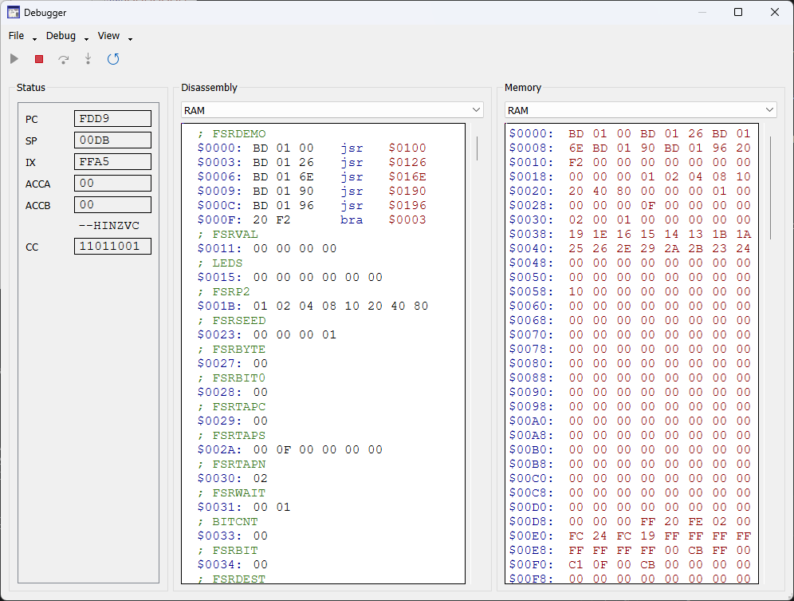
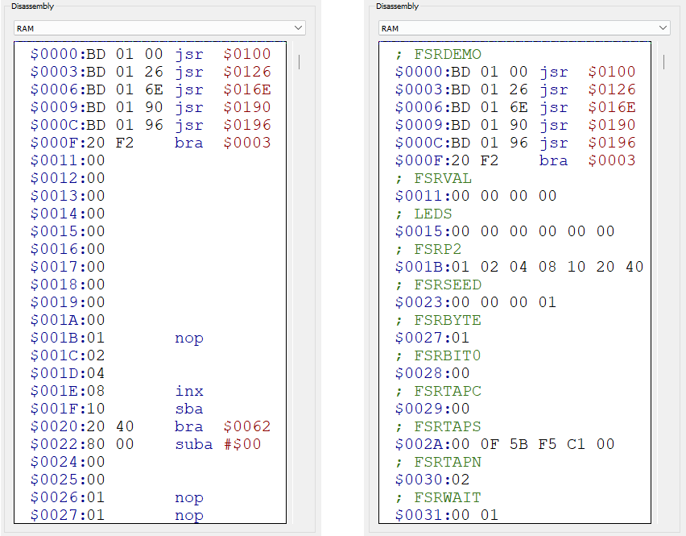

# ET-3400 Emulator

This is an emulator for the [Heathkit ET-3400 Trainer](http://www.oldcomputermuseum.com/heathkit_ET-3400.html) built in C++.

This is a port of my emulator built in C# (https://github.com/RupertAvery/ET-3400-emu) with the goal of better performance and speed accuracy, as well as portability, with Windows and Linux targets.

The Heathkit ET-3400 Trainer is a basic computer intended to teach microprocessor basics and assembly programming. The trainer was sold in kit form, requiring the user to build the device from the parts included in the kit.

# Acknowledgement

I would like to thank Rick Nungester for all his interactions and the folks at [groups.io/ET-3400](https://groups.io/g/ET-3400) for the community and wealth of information and documentation made available that has made this emulator much more accurate and useful.

For more information on the kit itself as well as access to the information, programs, listings and other files, please join the group.

# Command Line Arguments

Here are the optional command line arguments:

```
Usage: ET-3400.exe [options] [file]

Options:
  -m <path>            Load alternate monitor ROM from file (.s19, .hex, .bin)
  -s <speed>           Set clock speed 
  -d                   Show debugger on startup
  -l <path>            Load labels from file (.lbl) (see note 1)

  <file>               Load RAM contents from file (.s19, .obj)
```

The speed argument accepts the following formats:

```
n             - a percentage e.g. -s 25 will set the clock rate at 25% of 471kHz (see note 2)
n[k|M]Hz      - the speed of the clock specified in Hz, kHz or MHz (case insensitive)
                      e.g. -s 1000hz will set the clock to 1000Hz
                           -s 1Mhz will set the clock to 1MHz 
```

Notes:

1. See [Labels](#labels) for a description of this feature 

2. The default clock speed of 471kHz was suggested by Rick Nungester from tests on an actual ET-3400.

# What's emulated

* Motorola 8-bit 6800 CPU running at 471kHz 
* 6 7-segment LED displays
* Hex Keypad with 16 buttons (0-F) + Reset button
* 512B RAM
* 1KB Monitor ROM

The built-in ROM contains the Monitor program designed for the Heathkit ET-3400 Trainer, which interfaces with the keypad and display, and allows viewing and editing memory to enter and execute programs, and view CPU registers.

# Screenshot


# Features

* [Loading programs into RAM](#loading-programs-into-ram)
* [Saving Program RAM](#saving-program-ram)
* [Loading alternate ROM files](#loading-alternate-rom-files)
* [Debugger](#debugger)
* [Breakpoints](#breakpoints)
* [Labels](#labels)

## Loading programs into RAM

You can load compiled programs into emulator RAM.

Click `File` > `Load RAM` and select your file to load it into memory. 

The emulator supports the following formats:

Format | Extensions
-------|-----------
[Motorola S-record](https://en.wikipedia.org/wiki/Motorola_S-record) | `.S19` `.OBJ` 
[Intel HEX](https://en.wikipedia.org/wiki/Intel_HEX) | `.HEX` `.IHX`


## Saving Program RAM

You can save a range of RAM to a file so you can continue working on it at a later time.

Click `File` > `Save RAM` and select the file to save RAM to. 

You will be prompted to set the range of RAM that will be written to the file. The default range is `$0000` - `$01FF`

The same formats for loading RAM are supported.

## Loading alternate ROM files

You can load alternative / modded ROM files. The ROM should be exactly 1024 bytes.  Click `File` > `Load ROM` and select your file to load it into the ROM at `$FC00`. 

The following formats are supported:

Format | Extensions
-------|-----------
[Motorola S-record](https://en.wikipedia.org/wiki/Motorola_S-record) <sup>1</sup> | `.S19` `.OBJ` 
[Intel HEX](https://en.wikipedia.org/wiki/Intel_HEX) <sup>1</sup> | `.HEX` `.IHX`
Raw binary <sup>2</sup> | `.BIN` 

<sup>1</sup> For the S-Record and HEX format, you must ensure that the start address is at `$FC00` and the reset vector is set accordingly. 

<sup>2</sup> The BIN format is raw bytes with no headers. The file should be exactly 1024 bytes to fit in the ROM address space.

## Debugger

Pressing the "Debugger" menu item in the main window will display the debugger dialog.

The debugger lets you pause, single-step through instructions, and inspect CPU state, disassembly and memory.

The disassembly view also allows you to add labels and set breakpoints.

## A Note on Single-Step and Breakpoints

While the Debugger has single-step and breakpoints, these are not the same as and should not be confused with the Single-Step and Breakpoints on the ET-3400 interface.

The ET-3400 provides single-step and breakpoint features through software via the Monitor ROM — to do so, the CPU must be actively running so the monitor can track and respond to CPU state.

The Debugger operates at the hardware level, showing what is happening at the instruction level on the emulated hardware, independent of the monitor software. When a breakpoint is encountered or during single-step operation, the CPU is effectively halted.

This can lead to what might seem to be bugs or different behavior, but are simply different contexts. Some of these are discussed in the section [Emulation Quirks](#emulation-quirks)

Any time single-step and breakpoints are mentioned in the context of the debugger, this refers exclusively to  single-step and breakpoints within the debugger.

Unless specifically mentioned, single-step and breakpoints in this document will refer to the debugger feature. Where necessary, the ET-3400 feature will be referred to as software single-step and breakpoints.

### Controls

The following buttons can be found in the toolbar

*   &nbsp;**Run** - Resumes emulation
*  &nbsp;**Stop** - Pauses emulation
*  &nbsp;**Step Over** - Executes the next instruction. If it is a `JSR` or `BSR`, runs the entire subroutine and breaks on return.
*  &nbsp;**Step Into** - Executes the next instruction, entering any subroutine call.
*  &nbsp;**Step Out** - Runs until before the current subroutine returns (`RTS`), then breaks.
*  &nbsp;**Reset** - Reset emulator

The following keyboard shortcuts are also available:

* **F5** - Resumes emulation
* **F4** - Pauses emulation
* **F9** - Toggle Breakpoint on the currently highlighted line
* **F10** - Step Over
* **F11** - Step Into
* **Shift+F11** - Step Out 
* **ESC** - Reset emulator



### Menus

Most of the menu items are self-explanatory, but some may need clarification.

#### File

**Load Breakpoints** and **Save Breakpoints** refers to the the Debugger breakpoints, not any breakpoints created via the ET-3400 interface. 

#### Debug

**Clear RAM** will allow you to set a region of RAM to a desired value. This can be useful when clearing an existing program. A reset will be be performed after clearing RAM.

#### View

**Labels** shows a dialog where you can manage [labels](#labels) directly. You can also load and save, and navigate to different locations in the disassembly view by clicking on the labels listed. This dialog shows the labels in the currently selected memory-mapped device in the Disassembly view. 

**Breakpoints** shows a dialog where you can manage [breakpoints](#breakpoints) directly. You can also load and save, and navigate to different locations in the disassembly view by clicking on the breakpoints listed. This dialog shows all available breakpoints across all memory-mapped devices. Unchecking a breakpoint in the list will disable the breakpoint, preventing the emulator from stopping when it reaches the breakpoint address.

Toggling **Disassembly** and **Memory** will show or hide the respective pane in the view.

**Auto Refresh Disassembly** is useful for watching RAM updates live in the Disassembly view, to see variables or the stack being updated in real time. However, this usually requires that you have labels properly setup so that changing RAM does not affect the disassembly of any code after the variables or stack.

When enabled, the **Heat map** feature will highlight the addresses in memory that have changed since the last refresh which happens approximately every 100ms.

### Status Pane

The Status Pane displays the live contents of the CPU registers:

* PC - Program Counter
* SP - Stack Pointer
* IX - Index
* ACCA - Accumulator A
* ACCB - Accumulator B
* CC - Status in binary as --HINZVC

### Disassembly Pane

At the top of the pane you will see a dropdown containing the list of memory-mapped devices with data that can be disassembled, with the following devices available:  

- RAM
- Monitor ROM

Selecting one of these will display the disassembled contents of the selected memory-mapped device.

The disassembler reads consecutive bytes in memory and decodes them as instructions and operands — for example, `BD FC BC` becomes `JSR $FCBC`. 

By default it does so without context, so when data such as variables or lookup tables precedes executable code, the disassembler may misinterpret those bytes as instructions, causing incorrect disassembly from that point forward. 

You can use [labels](#labels) to mark regions of memory as DATA to force the disassembler to skip over the region. Adding a COMMENT will not affect disassembly and is used to label code as desired.

You can also set [breakpoints](#breakpoints) directly in the disassembly pane.

When the emulator is paused — either manually or at a breakpoint — the next instruction to be executed is highlighted in yellow.

Use the View > Refresh (Ctrl+R) function to update the disassembly view. This will run the disassembler over memory again, updating any values that have may have changed.

### Memory Pane

At the top of the pane is a dropdown containing the list of memory-mapped devices, including the Keypad and Display devices.

- RAM
- Keypad
- Display
- Monitor ROM

Selecting one of these will display the raw byte contents of the selected device.

The Display device does not actually have memory - it represents the last bytes written to the addresses indicated. To understand how the Display device works, please see [How the Display works](documentation/display_device.md) 

Likewise, the Keypad device reflects the current values of the lines that are decoded at the keypad address. These are data lines that are kept high at logic level 1 and are pulled low to logic level 0 when a key is held down.

## Breakpoints

NOTE: This section describes the debugger feature, not the ET-3400 software breakpoints.

### Setting a breakpoint

You can toggle a breakpoint at the currently selected line in the disassembly view by pressing F9.

You can also toggle a breakpoint at any line by hovering over the leftmost side of the disassembly view. An empty red circle will appear indicating a breakpoint can be set.


Setting a breakpoint will add a filled red circle to the left of the instructions, indicating that a breakpoint has been set.


### Hitting a breakpoint

When execution reaches the instruction where the breakpoint is set, the emulator will stop and the background color of the line will change to yellow, indicating that the instruction will be executed next when the emulator advances.


### Loading and Saving Breakpoints

Breakpoints can be loaded and saved from the toolbar menu (File > Load Breakpoints and File > Save Breakpoints)


## Labels

Labels allow you to label and categorize areas of memory and affect the way the memory is disassembled. The main purpose of this is to set a range of memory memory as a "data" block, forcing the disassembler to skip over the range and prevent it from being disassembled as instructions.

This is important when you have a section of memory that does not contain code and should not be disassembled as instructions. This allows any code following the data to be disassembled correctly.

Below is a view of a section of RAM before and after adding labels.



### Adding Labels

Labels can be added from the toolbar menu (Labels > Add Label) or by right-clicking on an unlabeled line in the disassembly view. 


You will be prompted to select a type of label: Comment or Data. 

**Comment** marks the instruction at the start address with a label, without affecting disassembly.

**Data** marks a range of memory (from start to end address) as raw data, suppressing disassembly and displaying the bytes directly.


### Editing and Removing Labels

You can edit or remove a label by right-clicking on a labeled range in the disassembly view.


### Loading and Saving Labels

Labels can be loaded and saved from the toolbar menu (**File > Load Labels (RAM)** and **File > Save Labels (RAM)**)

# Monitor ROM

The Monitor ROM forms the heart of the system and provides the functionality that monitors the keyboard, updates the display, allows inspection of the CPU status registers and entry of programs.

It is a 1024 byte (1KB) ROM chip that is address decoded at `FC00`.

* [ROM Analysis](documentation/rom_analysis.md)
*  [Annotated Listing](documentation/ET-3400.html)


# Manual

The original manual for this trainer is available in pdf format here: https://archive.org/details/HeathkitManualForTheEt-3400MicroprocessorTrainer

The manual describes assembling the kit, discusses basic operation and troubleshooting and includes sample program listings as well as an listing of the monitor ROM program.

It is a wealth of information and it is recommended that you take a look at it to understand how the device works. Listed below are sections that should be of particular interest.

| PDF Page | Manual Page | Section              | 
|:--------:|:-----------:|----------------------|
| 47-56    |  45-54      | Operation            |
| 57-66    |  55-64      | Sample Programs      |
| 67-74    |  65-72      | Sample Programs      |
| 75-87    |  73-85      | Monitor ROM Listing<sup>1</sup> |
| 89       |  87         | Memory Map           |
| 90       |  88         | Keyboard and Display Functioning Addresses |
| 91-92    |  89-90      | Instruction Set      |
| 110-111  |  108-109    | Theory of Operation  |
| 113      |   111       | Integrated Circuits  |
| 148-149  |             | Block Diagram        |
| 151-159  |             | Schematic Diagram    |

<sup>1</sup> The Monitor ROM listing in this edition of the manual is incomplete as it is missing several bytes, likely due to a misprint:

```
FC46-FC7D - BKSET and DOPMT routines
FF2A-FF2F - Start of SPECIAL HANDLERS
```

For the complete source code of the Monitor ROM, I recommend visiting https://groups.io/g/ET-3400/files/3.%20ROM%20Info/6.%20ET-3400%20Monitor%20source%20code and looking at ET-3400.LST

## Basic Usage

On startup, the display will read `CPU UP`.

Pressing one of the buttons will execute one of the built-in commands in the ROM. You can press the button by clicking with a mouse pointer, or pressing the corresponding key on the keybaord.

| Keypress |    Button     | Action                                            | 
|:--------:|:-------------:|---------------------------------------------------|
|    1     |  **ACCA**     | View contents of Accumulator A Register           |
|    2     |  **ACCB**     | View contents of Accumulator B Register		   |
|    3     |  **PC**       | View contents of Program Counter Register		   |
|    4     |  **INDEX**    | View contents of Index Pointer Register		   |
|    5     |  **CC**       | View contents of Condition Codes Register		   |
|    6     |  **SP**       | View contents of Stack Pointer Register		   |
|    7     |  **RTI**      | Return from Interrupt <sup>1</sup>       |
|    8     |  **SS**       | Single step <sup>2</sup> 					   |
|    9     |  **BR**       | Add breakpoint <sup>3</sup>  |
|    A     |  **AUTO**     | Start entering hex at specified address		   |
|    B     |  **BACK**     | During Examine mode, move address back 		       |
|    C     |  **CHAN**     | During Examine mode, edit hex at specified address. During ACCA/ACCB/PC mode, edit hex in selected register |
|    D     |  **DO**       | Execute RAM at given address                      |
|    E     |  **EXAM**     | Start viewing hex at specified address            |
|    F     |  **FWD**      | During Examine mode, move address forward         |
|   ESC    |  **RESET**    | Reset the CPU <sup>4</sup>        |

**Notes**

<sup>1</sup> When the program is halted at software breakpoint, this will resume execution.

<sup>2, 3</sup> Features of the ROM that simulate debugger behavior in software. These are implemented by the ET-3400 ROM, and are not related to the emulator Debugger and will behave differently.

<sup>4</sup> RESET only takes effect while the CPU is running. It has no effect when the CPU is paused, and single-stepping after pressing RESET will also have no effect — the RESET line is released as soon as the key is released.

## Sample Program

This sample program cycles through each segment on each display, repeating continuously.

To enter the program, press `A`, then type `0000` to begin entering hex data at that address. Enter the bytes from the Instr column below, making sure each instruction lands at the correct address. If you make a mistake, press `ESC` or `RESET` to reset, then press `A` again and enter the address where you want to resume.

Press `E` to inspect memory, then `F` or `B` to step forward or backward through addresses. While viewing the contents of memory, you can press `C` to edit the value at the current address.

To run the program, press `D` and enter `0000`.

```
Addr Instr     Label    Disassembly        Comments
=============================================================================
0000 BD FCBC   START    JSR    REDIS       SET UP FIRST DISPLAY ADDRESS
0003 86 01              LDA A  #S01        FIRST SEGMENT CODE
0005 20 07              BRA    OUT         
0007 D6 F1     SAME     LDA B  DIGADD+1    FIX DISPLAY ADDRESS
0009 CB 10              ADD B  #$10        FOR NEXT SEGMENT
000B D7 F1              STA B  DIGADD+1    
000D 48                 ASL A              NEXT SEGMENT CODE
000E BD FE3A   OUT      JSR    OUTCH       OUTPUT SEGMENT
0011 CE 2F00            LDX    #$2F00      TIME TO WAIT
0014 09        WAIT     DEX                
0015 26 FD              BNE    WAIT        TIME OUT YET?
0017 16                 TAB                
0018 5D                 TST B              LAST SEGMENT THIS DISPLAY?
0019 26 EC              BNE    SAME        NEXT SEGMENT
001B 86 01              LDA A  #$01        RESET SEGMENT CODE
001D DE F0              LDX    DIGADD      NEXT DISPLAY
001F 8C C10F            CPX    #$C10F      LAST DISPLAY YET?
0022 26 EA              BNE    OUT         
0024 20 DA              BRA    START       DO AGAIN
```

NOTE: The labels `REDIS`, `DIGADD`, and `OUTCH` refer to subroutines in the Monitor ROM that perform certain functions.

The sample programs source code are available in Motorola S-record and Intel HEX format here https://groups.io/g/ET-3400/files/9.%20Sample%20Programs/Sample%20Programs%20Hex

These files can be loaded directly into the emulator

# Emulation Quirks

## Debugger breakpoints at the same address entered in DO command are not hit on first execution

If you set an debugger breakpoint at an address and execute the  `DO` command with the same address, the breakpoint will not be hit on the first execution.

For example, if you set a debugger breakpoint at `$0000` and then press `DO` then `0000`, the emulator will not break at that address.

This is due to how the Monitor ROM handles its own software breakpoints.

The ET-3400 ROM contains routines for montitoring execution and displaying registers, and one of its features is a breakpoint handler that supports up to 4 breakpoints.

When you enter breakpoints using ET-3400 ROM by pressing the `BR` button, the ROM saves the addresses you enter in its reserved RAM for breakpoint addresses. When you execute a program with `DO`, the ROM will patch the addresses with a `3F` - the software vector interrupt - so that it can handle the instruction itself.

The Monitor ROM's `DO` command does not jump directly to the entered address. Instead, it performs a [software single-step](documentation/rom_analysis.md#single-stepping-step-sstep) in order to catch and handle a possible software breakpoint. 

Because execution doesn't pass through the original start address, any debugger breakpoint set there will not be hit on first execution, although if the program branches to the address afterwards the emulator will break at that address.  

The relevant routine is `SSTEP` in the Monitor ROM at `$FE6B`.

## ET-3400 EXAM and Debugger Disassembly / Memory values disagree when examining stack addresses

If you press `EXAM 00D0` and step through the stack using `FWD`, you may notice that some values shown on the ET-3400's display do not match the values in the Debugger's Disassembly and Memory panes.

This is not a bug. The monitor ROM code that reads and displays stack memory also uses the stack itself. As it reads a value to display, it simultaneously writes to the stack — so the value it reads is briefly whatever happens to be at that address during that write. The Debugger shows the final settled value in memory, while the ET-3400 display shows the transient value captured mid-write.

## ET-3400 behavior with Single-Step (SS) may be different from Debugger single-step

This is less of a quirk and more of a difference in how each single-step operates.

The ET-3400's Single-Step is a software routine in the Monitor ROM. For each instruction, it copies the instruction bytes onto the stack, executes them there, then returns control to the ROM so it can update the display and respond to keypresses. The CPU keeps running throughout — the ROM is managing every step.

The Debugger's single-step works differently: it pauses the CPU entirely and executes each instruction directly, without any ROM involvement.

**Example: stepping over a `SWI` instruction**

| | Next address shown | Vector used |
|---|---|---|
| ET-3400 Single-Step | `$00FA` — User SWI Vector | Set by the ROM's SWI handler |
| Debugger Step | `$00F4` — System SWI Vector | Read from ROM at `$FFFA` |

When the ET-3400 single-steps over `SWI`, the Single-Step routine intercepts the instruction and redirects execution to `$00FA` (the "User" SWI vector). The Debugger shows what actually happens in hardware: it pushes registers to the stack and jumps to the vector stored at `$FFFA`, which in the standard ROM points to `$00F4`.

##


# Development

The code is cross-platofrm and can be compiled and executed on Windows and Linux. Mac OS is probably also possible, but I haven't tested it.

## Windows

### Requiremments

* Visual Studio 2017 or later
* git
* CMake (https://cmake.org/download/)
* vcpkg (see below)
* Qt libraries

### Clone this repository

```
git clone https://github.com/RupertAvery/ET-3400.git
```

### Installing vcpkg 

`vcpkg` is a tool from Microsoft to install C++ libraries from source.

Install vcpkg (https://github.com/microsoft/vcpkg)

```
git clone https://github.com/microsoft/vcpkg
cd vcpkg
bootstrap-vcpkg.bat
```

### Installing Qt packages

In the `vcpkg` directory run the following command

```
vcpkg install qt5-base qt5-multimedia
```

or if you want 64-bit

```
vcpkg install qt5-base qt5-multimedia --triplet x64-windows
```


This will take a while. Go watch a movie.

### Building

Perform a standard out-of-source build.

**NOTE:** This has only been tested on **Visual Studio 16 2019**. For other targets you may need to add `-G "Visual Studio 15 2017 [arch]"`

**x86**

```
md build
cd build
cmake .. "-DCMAKE_TOOLCHAIN_FILE=<path-to-vckpkg>\scripts\buildsystems\vcpkg.cmake" -A Win32 -DCMAKE_BUILD_TYPE=Debug
```

**x64**

```
md build
cd build
cmake .. "-DCMAKE_TOOLCHAIN_FILE=<path-to-vckpkg>\scripts\buildsystems\vcpkg.cmake" -A x64 -DCMAKE_BUILD_TYPE=Debug
```

For Release mode, change CMAKE_BUILD_TYPE accordingly.

Remember to clear out the build folder, or use a different folder if changing architectures or build types.
 
This will generate a `.sln` and all necessary files in the `build` folder.

You should be able to compile the solution into an executable with

```
cmake --build . --config Debug
```

CMake should launch msbuild for you.

You can also open the `.sln` file in Visual Studio if you have C++ workload installed, and compile and debug from there.


## Linux

### Requiremments

* build-essentials
* git
* cmake
* Qt libraries


## Installation

Install the necessary packages (Note: This was from 2022)

```
sudo apt-get update
sudo apt install git build-essential cmake qt5-base qt5-multimedia
```

If this does not work, you might want to try the following (from https://github.com/RupertAvery/ET-3400/issues/13)

```
apt-get install cmake-dbgsym cmake-qt-gui-dbgsym cmake
apt-get install qt5ct
apt-get install qtbase5-dev
apt-get install qtdeclarative5-dev
```

### Clone this repository

```
git clone https://github.com/RupertAvery/ET-3400.git
```

### Build and compile

Perform a standard out-of-source build.

```
cd ET-3400/build
cmake ..
make
```

The executable `ET-3400` will be created in the `build` directory.
