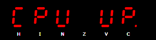
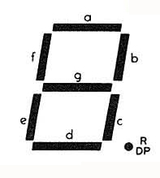
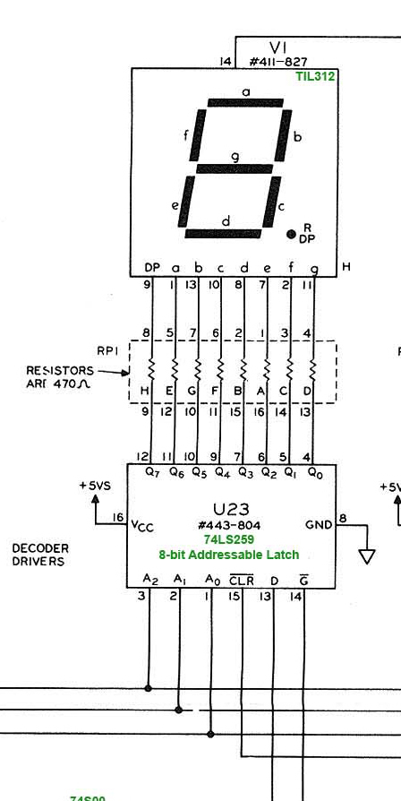

# How the Display works

The Display emulates six 7-segment LED displays as a memory-mapped device.

The displays are arranged horizontally and labeled from left to right: H I N Z V C, after the flags in the Condition Codes (CC) register.



Each 7-segment display consists of 7 LEDs arranged in a pattern resembling the number 8, plus a small dot LED at the bottom right.



Each display is connected to an 8-bit addressable latch. The latch has 3 select inputs (labeled A<sub>0</sub>, A<sub>1</sub>, A<sub>2</sub> in the diagram below), 8 outputs (Q<sub>0</sub> to Q<sub>7</sub>), a data line (D), and an enable line (<span style="text-decoration: overline;">G</span>).

The select inputs control which one of the 8 outputs is currently selected, whereupon the value of the data line is latched into that output when the enable line is pulled low.

Once latched, an output remains at the level it was latched to until the latch is re-enabled.

The 8 outputs are each connected to an LED in the display.



# Address Decoding

A memory-mapped device is accessed like ordinary memory from the CPU's point of view, hence the term. To control or update the device, you write data to a specific address or range of addresses, the addresses that the device is mapped to in memory.

To map a device into memory requires address decoding. Address decoding ensures that only one device responds to a given address. When a value is placed on the address bus, a set of circuits decodes the address and asserts a signal that enables the target device when the address falls within its assigned range.

Each latch can be thought of as a write-only memory device, where each output is like a 1-bit memory cell. Each output requires one decoded address, so one latch uses 8 addresses to store 1 bit for each LED.

Controlling a single LED requires selecting one of the six display latches, selecting one of its outputs, then setting the data line high (ON) or low (OFF).

In the ET3400, address bits 0, 1, 2 are connected to the latch select inputs A<sub>0</sub>, A<sub>1</sub>, A<sub>2</sub>. These three bits select which output — and therefore which LED — is written. 

2 | 1 | 0 | Latched Output | LED
:-:|:-:|:-:|:-:|:-:
0 | 0 | 0 | 0 | g  
0 | 0 | 1 | 1 | f  
0 | 1 | 0 | 2 | e  
0 | 1 | 1 | 3 | d  
1 | 0 | 0 | 4 | c  
1 | 0 | 1 | 5 | b  
1 | 1 | 0 | 6 | a  
1 | 1 | 1 | 7 | DP 

The display latches all share the same inputs, so they must be enabled one at a time when writing. This is the job of the 4-to-10 line decoder.

Address bits 4, 5, 6 are connected to the 4-to-10 line decoder (using only 3 of the input lines) that enables or _selects_ one of the six display latches when it itself is enabled, and a value is placed on the 3 inputs.

6 | 5 | 4 | Selected Latch
:-:|:-:|:-:|:-:
0 | 0 | 0 | Not used
0 | 0 | 1 | C
0 | 1 | 0 | V
0 | 1 | 1 | Z
1 | 0 | 0 | N
1 | 0 | 1 | I
1 | 1 | 0 | H
1 | 1 | 1 | Not used

The upper address bits 8-15 are decoded using ICs so that a value of `C1` (`11000001` in binary) enables the 4-to-10 line decoder. 

This completes the address decoding.

As a result, each display or digit is accessed over a range of 16 addresses.

Digit | Address
:--:|---
H | C160-C16F
I | C150-C15F
N | C140-C14F
Z | C130-C13F
V | C120-C12F
C | C110-C11F

Altogether, we can write out the decoding scheme like so:

```
Address bit    15 14 13 12 11 10 09 08 07 06 05 04 03 02 01 00
                1  1  0  0  0  0  0  1  -  D  D  D  -  S  S  S

Bits 15-12      C
Bits 11-08      1
Bit 7           DON'T CARE
Bits 06-04      Digit select, 01-06
Bit 3           DON'T CARE
Bits 02-00      Segment select, 00-07
```

## Mirroring

You may have noticed that bits 3 and 7 are not connected, or undecoded. In documentation they are sometimes referred to as "DON'T CARE" bits.

This means that a value of 0 or 1 on this bit does not affect address decoding - only the decoded bits matter.

As a result, writing to 4 different locations has the same effect. We call this behavior "mirroring".

For example, writing to `$C166`, `$C16E`, `$C1E6` or `$C1EE` all affect segment `a` of display `H`. 

The reason this is done is usually to save on the cost of additional ICs or logic gates required to completely decode every address bit.

We can map out each segment on each display on a grid as follows, where the numbered column headers represent the segment address nybble.

Display | Digit | 0/8 | 1/9 | 2/A | 3/B | 4/C | 5/D | 6/E | 7/F
:-:|:-:|:-:|:-:|:-:|:-:|:-:|:-:|:-:|:-:
&nbsp; | 7/F | - | - | - | - | - | - | - | -
**H** | 6/E | g | f | e | d | c | b | a | DP
**I** | 5/D | g | f | e | d | c | b | a | DP
**N** | 4/C | g | f | e | d | c | b | a | DP
**Z** | 3/B | g | f | e | d | c | b | a | DP
**V** | 2/A | g | f | e | d | c | b | a | DP
**C** | 1/9 | g | f | e | d | c | b | a | DP
&nbsp; | 0/8 | - | - | - | - | - | - | - | -

Then the address for each display segment will be:

```
Display Segment Address = C1[Digit][Segment]
```

# Writing to the Display

Because each latch has only one data line, you can only write one segment at a time. Each latch's data line is connected to bit 0 of the CPU data bus, so no matter what value you write, only the first bit of the value is used.

To display the letter C on display H, you need to light segments a, d, e, and f. This corresponds to addresses starting with C1, with a Digit select value of 6 and a Segment select value of 6, 3, 2 and 1.

Display H is accessed on C16X where X is the lower 4 bits of the address. 

Display | Digit | 0/8 | 1/9 | 2/A | 3/B | 4/C | 5/D | 6/E | 7/F
:-:|:-:|:-:|:-:|:-:|:-:|:-:|:-:|:-:|:-:
**H** | 6/E | 0 | 1 | 1 | 1 | 0 | 0 | 1 | 0

The sample program below does this and loops forever:

```
$0000  86 01      ldaa #$01
$0002  B7 C1 66   staa $C166
$0005  B7 C1 63   staa $C163
$0008  B7 C1 62   staa $C162
$000B  B7 C1 61   staa $C161
$000E  20 F0      bra  $0000 
```

Enter this program and run it with `DO 0000`. Thankfully, the Monitor ROM clears the screen when we start a program with DO, so we don't have to do it ourselves.  

# The `OUTCH` Monitor ROM Routine

The purpose of the `OUTCH` routine is to take a byte stored in `ACCA` and spread the bits out into 8 addresses for the current display segment address, stored in X, which is loaded from `$F0`, labeled `DIGADD` in the ROM listing.

Suppose we want to write `C` to a display. We store all the bits for one character in one byte somewhere in memory, and load it into Accumulator A.

With the bits for a, d, e, and f set to 1 we have

&nbsp;| 7 | 6 | 5 | 4 | 3 | 2 | 1 | 0 | &nbsp;
-:|:-:|:-:|:-:|:-:|:-:|:-:|:-:|:-:|-
Segment|DP|a|b|c|d|e|f|g|
ACCA|0|1|0|0|1|1|1|0| $4E

The Segment row is included to show which segment the bit _should_ be loaded into, and thus which _address_ it is expected to be loaded into. We will call this our _character segment_.

We need to store each bit in a separate address, starting with the bit 7 (DP) into `$C167` up to bit 0 (segment g) into `$C160`. However, the ROM instead does two passes starting at `$C16F`.  

The `OUTCH` routine is located at `$FE3A`

First, we save X into `$EC` (`T0`) because we will be using the index register in our routine, then load X with the value at `$F0` (`DIGADD`), which will be `$C16F` if we previously called `REDIS`. We push `ACCB` onto the stack as we will also be using it as a counter.

```
STX EC
LDX F0
PSHB
```

We rotate accumulator A twice, which doesn't make sense until later. We also load accumulator B with the value of 16 decimal or 10 hex, initializing our counter.

```
ROLA
ROLA
LDAB #$10
```

&nbsp;| Carry | 7 | 6 | 5 | 4 | 3 | 2 | 1 | 0 | &nbsp;
-:|:-:|:-:|:-:|:-:|:-:|:-:|:-:|:-:|:-:|-
Segment|x|DP|a|b|c|d|e|f|g|
ACCA|0|0|1|0|0|1|1|1|0| $4E
ROLA | | | | | | | | |
Segment|DP|a|b|c|d|e|f|g|x|
ACCA|0|1|0|0|1|1|1|0|0| $9C
ROLA | | | | | | | | |
Segment|a|b|c|d|e|f|g|x|DP|
ACCA|1|0|0|1|1|1|0|0|0| $38

We then enter a loop where we rotate accumulator A, store it in the address pointed to by X (with an offset of 0), decrease X and B. We then loop until B is 0. Since we started with B = 16, this loop is repeated 16 times.

```
ROLA
STAA 0,X
DEX	
DECB
BNE F9
```

&nbsp;| Carry | 7 | 6 | 5 | 4 | 3 | 2 | 1 | 0 | &nbsp;
-:|:-:|:-:|:-:|:-:|:-:|:-:|:-:|:-:|:-:|-
ROLA | | | | | | | | |
Segment|b|c|d|e|f|g|x|DP|a|
ACCA|0|0|1|1|1|0|0|0|1| $71
STAA 0,X | | | | | | | | | | $C16F
DEX | | | | | | | | | | $C16E

This has the effect of rotating the bits and loading whatever is in bit 0 to the current display/segment address.

Currently we are at the starting address `$C16F`, which is the mirrored address for `$C167`. This is the display/segment address for H/DP, but we are writing the bit for our character segment a.

This is the "first pass" and there seems there is no other reason this is done than it simplifies the code. Since we will pass by `$C167` later, we have the opportunity to correct the data. 

&nbsp;| Carry | 7 | 6 | 5 | 4 | 3 | 2 | 1 | 0 | &nbsp;
-:|:-:|:-:|:-:|:-:|:-:|:-:|:-:|:-:|:-:|-
ROLA | | | | | | | | |
Segment|c|d|e|f|g|x|DP|a|b|
ACCA|0|1|1|1|0|0|0|1|0| $E2
STAA 0,X | | | | | | | | | | $C16E
DEX | | | | | | | | | | $C16D
ROLA | | | | | | | | |
Segment|d|e|f|g|x|DP|a|b|c|
ACCA|1|1|1|0|0|0|1|0|0| $C4
STAA 0,X | | | | | | | | | | $C16D
DEX | | | | | | | | | | $C16C
ROLA | | | | | | | | |
Segment|e|f|g|x|DP|a|b|c|d|
ACCA|1|1|0|0|0|1|0|0|1| $89
STAA 0,X | | | | | | | | | | $C16C
DEX | | | | | | | | | | $C16B
ROLA | | | | | | | | |
Segment|f|g|x|DP|a|b|c|d|e|
ACCA|1|0|0|0|1|0|0|1|1| $13
STAA 0,X | | | | | | | | | | $C16B
DEX | | | | | | | | | | $C16A
ROLA | | | | | | | | |
Segment|g|x|DP|a|b|c|d|e|f|
ACCA|0|0|0|1|0|0|1|1|1| $27
STAA 0,X | | | | | | | | | | $C16A
DEX | | | | | | | | | | $C169
ROLA | | | | | | | | |
Segment|x|DP|a|b|c|d|e|f|g|
ACCA|0|0|1|0|0|1|1|1|0| $4E
STAA 0,X | | | | | | | | | | $C168
DEX | | | | | | | | | | $C167

When we reach `$C167`, we are back where we started, but with the next ROLA, DP will now be in bit 0, meaning that the rotation is now aligned with the correct display/segment address. 

The reason why we pre-rotated A twice is because we want to start at `$C16F` (this is a bit important) and we need to decrement B and rotate A 16 times to reach the bottom of the address `$C160`, and in doing so we have to rotate through an extra bit - the carry flag - twice. 

We don't care about the first 8 writes, which will write the wrong bits to the display output segments, because when we reach `$C167`, the bits will be correctly aligned. 

After a ROLA you can see that segment DP is now in bit 0, ready to be loaded into `$C167`, which is the address for H/DP.

&nbsp;| Carry | 7 | 6 | 5 | 4 | 3 | 2 | 1 | 0 | &nbsp;
-:|:-:|:-:|:-:|:-:|:-:|:-:|:-:|:-:|:-:|-
ROLA | | | | | | | | |
Segment|a|b|c|d|e|f|g|x|DP|
ACCA|1|0|0|1|1|1|0|0|0| $38
STAA 0,X | | | | | | | | | | $C167
DEX | | | | | | | | | | $C166
ROLA | | | | | | | | |
Segment|b|c|d|e|f|g|x|DP|a|
ACCA|0|0|1|1|1|0|0|0|1| $71
STAA 0,X | | | | | | | | | | $C166
DEX | | | | | | | | | | $C165
ROLA | | | | | | | | |
Segment|c|d|e|f|g|x|DP|a|b|
ACCA|0|1|1|1|0|0|0|1|0| $E2
STAA 0,X | | | | | | | | | | $C165
DEX | | | | | | | | | | $C164
ROLA | | | | | | | | |
Segment|d|e|f|g|x|DP|a|b|c|
ACCA|1|1|1|0|0|0|1|0|0| $C4
STAA 0,X | | | | | | | | | | $C164
DEX | | | | | | | | | | $C163
ROLA | | | | | | | | |
Segment|e|f|g|x|DP|a|b|c|d|
ACCA|1|1|0|0|0|1|0|0|1| $89
STAA 0,X | | | | | | | | | | $C163
DEX | | | | | | | | | | $C162
ROLA | | | | | | | | |
Segment|f|g|x|DP|a|b|c|d|e|
ACCA|1|0|0|0|1|0|0|1|1| $13
STAA 0,X | | | | | | | | | | $C162
DEX | | | | | | | | | | $C161
ROLA | | | | | | | | |
Segment|g|x|DP|a|b|c|d|e|f|
ACCA|0|0|0|1|0|0|1|1|1| $27
STAA 0,X | | | | | | | | | | $C161
DEX | | | | | | | | | | $C160
ROLA | | | | | | | | |
Segment|x|DP|a|b|c|d|e|f|g|
ACCA|0|0|1|0|0|1|1|1|0| $4E
STAA 0,X | | | | | | | | | | $C160
DEX | | | | | | | | | | $C15F

At this point Accumulator B is zero, and the loop exits.

X now points to the next display digit. We store it back into `DIGADD` as we are done writing one character, we restore X and B, and return to the caller.

The reason why `$C16F` was chosen seems to be - decrementing 16 times will get us from one digit address (H) to the next `$C15F` (I) with one loop. We sacrifice writing an extra 8 loops to avoid writing logic to jump from `$C160` to `$C157`.


